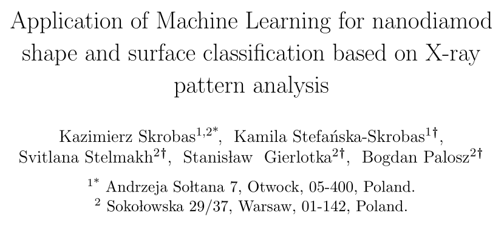
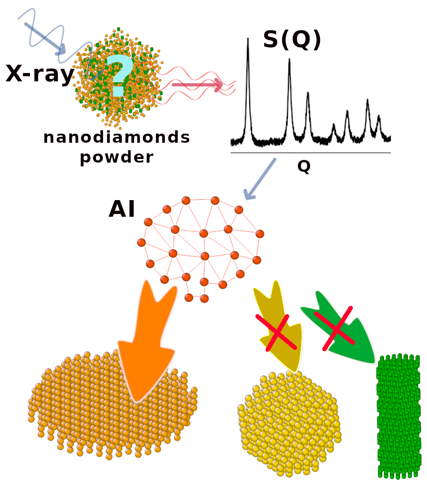

Python scripts for AI training ,  shape/surface recognition and data presentation.

###################################################################################

See more (to be published):

###################################################################################

See also:
https://github.com/kskrobas/npcl64

Trainig sets: https://unipress.waw.pl/nanopdf/

###################################################################################

###################################################################################3

