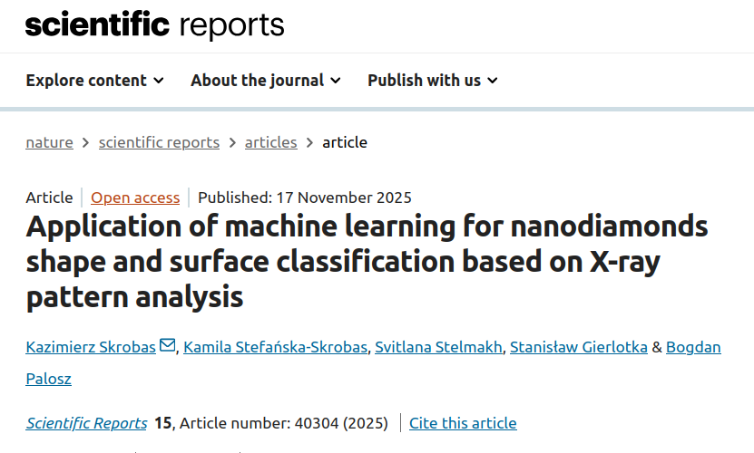
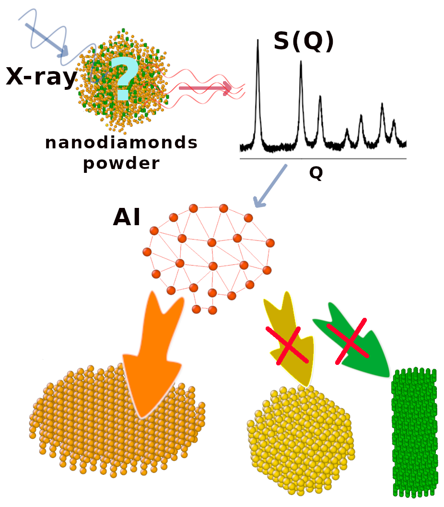

Python scripts for S(Q) data background correction, AI training,  shape/surface recognition and data presentation.

###############################################################################

See more: https://doi.org/10.1038/s41598-025-24143-z

###############################################################################

See also:
https://github.com/kskrobas/npcl64

Trainig sets: https://unipress.waw.pl/nanopdf/

###############################################################################

###############################################################################

